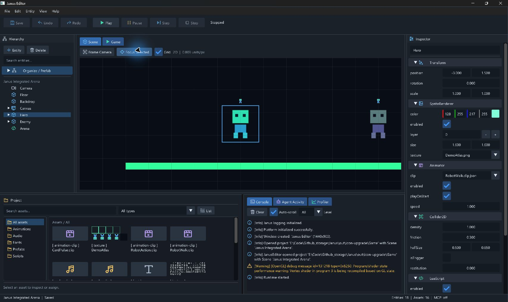

# 编辑器图标套件与集成验收

日期：2026-09-07；基于 `7ecdfb8` 的本分支 UI 升级。合并状态以 Git/PR 为准，v0.10 尚未发布。

## 交付

40 枚原创矢量图标，参考用户截图的编辑器视觉语言，采用 24×24 网格、2 单位描边、
圆角端点和统一语义配色。文字标签保留；禁用态与 ImGui 控件同步变淡。
图标没有从参考图裁剪，也没有引入第三方图标字体或运行时 SVG 依赖。

- [素材与分类](../../Editor/Icons/README.md)
- [SVG 总览](../../Editor/Icons/preview.html)：每个图标提供 16 / 24 / 40 px 展示。
- [生成器](../../tools/generate_editor_icons.py)：唯一几何定义，Python 标准库生成 SVG 及编译用矢量命令。
- [原生绘制](../../Editor/EditorIcons.cpp)：仅依赖已有 ImGui，沿用字号/DPI、透明度、控件 ID 和现有命令入口。

已接入 Save/Undo/Redo、Play/Pause/Resume/Step/Stop、Frame/Focus、Scene/Game 和诊断标签、
Hierarchy/Inspector 标题、实体类型、组件标题、目录、非纹理资源卡片、列表模式及日志严重度。
Move/Rotate/Scale 等作为素材储备，未新增无后端能力的按钮。

## 验证

```powershell
python tools/generate_editor_icons.py --check
cmake --preset windows-msvc-debug
cmake --build --preset windows-msvc-debug --parallel 2
cmake --preset windows-msvc-debug-tests
cmake --build --preset windows-msvc-debug-tests --parallel 2
ctest --preset windows-msvc-debug-tests --output-on-failure
git diff --check
```

40 个 SVG 经 XML 解析通过；43 个派生文件与生成器一致。两套 Debug 配置/构建成功。
最终全量回归 415/415 通过，58.64 秒；本轮是显示层接入，未增加 Engine/MCP 行为或依赖。
既有 `getenv` C4996 警告保留，未声称零警告构建。

原生验收使用 `out/icon-upgrade/Game` 副本：963×631 紧凑窗口及 1707×1019 最大化截图。
确认图标与文字并存，类型色可区分 Camera / Entity / Canvas / Script，非纹理卡片显示动画图标，
日志显示 Info/Warning 图形。初次实机发现标题图标被内容 clip 遮挡、组件图标与箭头过近，
已分别修正为标题区域裁剪及独立间距。

最终复验通过：标题图标完整可见，折叠箭头与图标分离；Play/Pause/Stop 状态切换正常，
Pause 切换为绿色 Play 图形和 Resume 文案，禁用态图标与文字同步变淡；Stop 返回 Scene；
拖动底部分栏后动画/音频/字体资源图标可辨识，Focus Selected 正常。
副本最终保持 Saved / Stopped，原 Game 资产未更改。

本地图标总览 HTML 受内置浏览器 file URL 策略限制，
未在该浏览器验收；原生 UI 的已接入图标使用实际绘制结果检查。
构建、CTest、运行日志及截图保存在忽略目录 `out/icon-upgrade/`。


