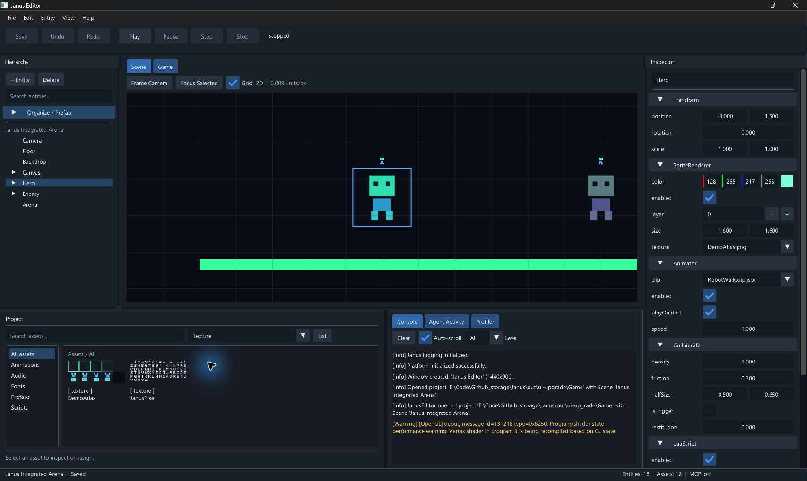

# 参考图布局驱动的原生编辑器 UI 升级

日期：2026-09-07。基线 `7ecdfb8`，工作分支 `codex/v0.10-project-status`。
这是本分支实现与本地验收记录；合并状态以 Git/PR 为准，v0.10 尚未发布。
用户要求以提供的编辑器参考图为布局范本；本轮使用 Janus 真实组件与 Integrated 示例。

## 实现范围

- 顶部菜单与固定位置 Save / Undo / Redo / Play / Pause 或 Resume / Step / Stop；项目设置独立窗口。
- 左侧 Hierarchy，中间 Scene / Game，右侧全高 Inspector；宽窗口底部分开 Project 与诊断，窄窗口合并标签。
- 左右及底部分隔线可拖动，View 提供 Reset Layout；DPI 自动缩放及 100% / 125% / 150% 用户倍率。
- 深色主题、区分标题/内容/选中态、状态栏显示实际场景 dirty、实体/资源数量及 MCP stdio 是否启用。
- Hierarchy 搜索，组织层级/Prefab 操作默认收起；Inspector 仅展示已有组件，Transform / SpriteRenderer 优先，字段左标签右输入，统一 Add Component，右键组件标题移除组件。
- Inspector 资源槽按反射约束列出注册资源，显示文件名，支持 None；UUID 和完整路径保留在提示中。包括 Image.texture 与 Animator.clip。
- Project 支持目录、名称/路径搜索、七类资源筛选、Grid/List、真实纹理预览、AnimationClip 赋给 Animator。
- Scene 使用深色背景、可切换网格、Sprite 选中轮廓、首次相机取景、Frame Camera / Focus Selected / F。
- Console 保留真实日志并按严重度着色，Agent Activity / Profiler 在同一诊断分区；Stop 恢复运行前的视图。
- Ctrl+S/Z/Y 通过既有受保护入口执行，文本编辑和 Game 输入优先；Esc 不再请求应用退出。

所有作者态修改继续经 EditorActions / ProjectSession / CommandBus。新 UI 禁用没有取代
Runtime、事务或 recovery 的后端 guard。布局、取景和显示参数不进入 Scene 命令历史。
Renderer2D 仅增加现有设备纹理展示句柄的转发；SceneRenderRequest 增加默认白色的可选
clearColor，Editor Scene 指定深色，Game 与其他调用方保持原默认行为；无新依赖。

## 验证

从 Visual Studio Developer PowerShell（MSVC 14.38）执行：

```powershell
cmake --preset windows-msvc-debug
cmake --build --preset windows-msvc-debug --parallel 2
cmake --preset windows-msvc-debug-tests
cmake --build --preset windows-msvc-debug-tests --parallel 2
& out/build/windows-msvc-debug-tests/Tests/JanusTests.exe '[workspace],[camera],[renderer2d],[scene][render]'
ctest --preset windows-msvc-debug-tests --output-on-failure
git diff --check
```

两套配置和构建成功；定向 27 cases / 402 assertions 通过。最终全量 415/415 通过，零失败，56.87 秒。
新增覆盖分栏边界/窄窗口、米制场景取景及非法请求、宿主背景色；纹理展示句柄测试覆盖有效和空句柄。
已有 C4996 getenv 与 C4834 测试返回值警告仍在，未将其描述为零警告构建。
配置提示可选 PkgConfig / LibUSB 缺失，但 Windows SDL 后端配置成功。

原生 UI 在 `out/ui-upgrade/Game` 副本完成，未修改仓库 Game 资产。截图采用系统 150% 缩放下
963×631 与最大化 1707×1019 的工具逻辑截图尺寸，不能等同于物理显示器分辨率。

已观察：小窗口合并底部标签、最大化分区；Hero 选择后 Transform 优先与 Sprite 轮廓；
Frame Camera 取景；Animator 只列动画资源，将 RobotWalk 改为 RobotAction 后 Ctrl+Z 恢复；
Ctrl+S 保存副本；Play 切 Game，实际 Start Battle 按钮生效，Pause/Step 保持 Paused，
Stop 返回 Scene 并恢复作者态输入；底部拖动改变资源区高度。

实机迭代还修正了分隔线窗口的最小尺寸遮挡、Esc 默认键盘导航未启用的问题。
最终版本复验：拖动底部分隔线后 Project / Console 标题均完整；Animator 下拉框按 Esc 收起，
编辑器继续运行且未改变属性；Focus Selected 显示 Hero 与选中轮廓；Texture 类型筛选仅显示
DemoAtlas / JanusPixel 两张实际纹理。最新窗口保留在 Stopped、Saved 状态供查看。

本地证据保存在忽略目录 `out/ui-upgrade/`：configure/build 日志、focused-final.log、
ctest-final.log、editor-verified-stdout.log / stderr.log、compact.png、paused.png、editor-upgraded.png。
控制台观察到 OpenGL 驱动 shader recompilation 性能警告；没有将此当作 GPU 性能通过证明。

## 尚未包含

本轮完成参考布局和已有能力的入口升级，不是整个 R1–R8 Release 计划验收。
PM-01 未保存关闭保护仍未完成；自由 docking、跨启动保存布局、中文本地化、Move/Rotate/Scale
操纵器、新建/打开/另存场景、通用导入、可读 Prefab 导出名仍待后续切片。
资源目录目前来自注册表的目录列表，搜索区分大小写；非纹理资源显示类型占位卡片，纹理预览
展示整张图集，尚无动画播放预览。UIRect 在 Game 视图预览，不纳入世界 Sprite 的 Focus。
本轮未声称多屏 DPI 切换、全部资源类别的端到端人工赋值或干净机器 Release 包已验收。


