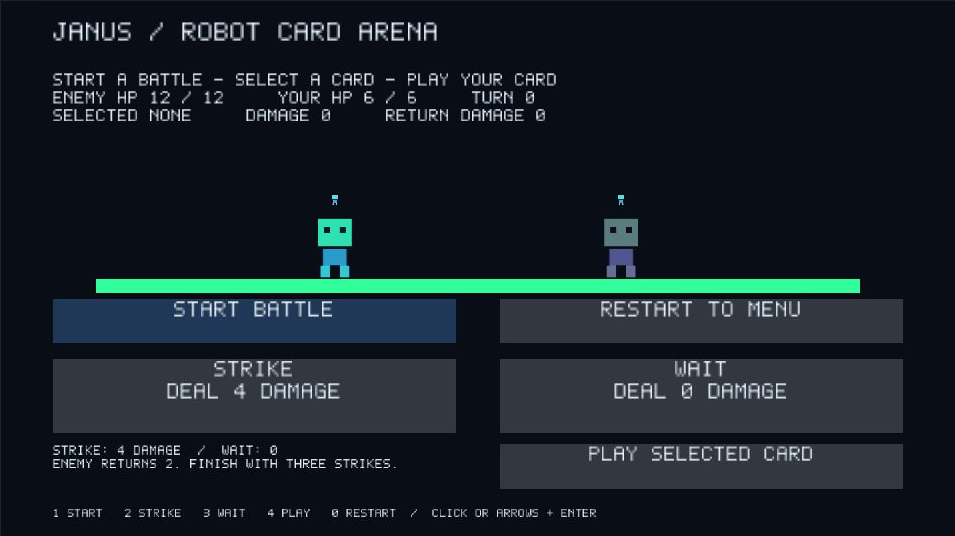
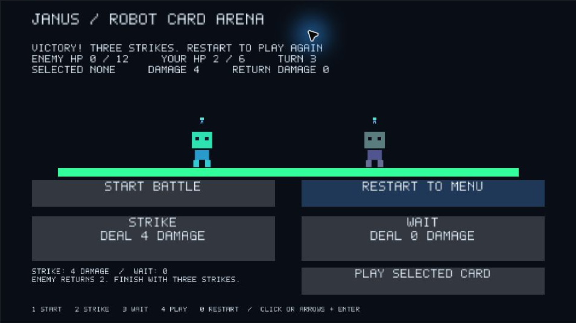
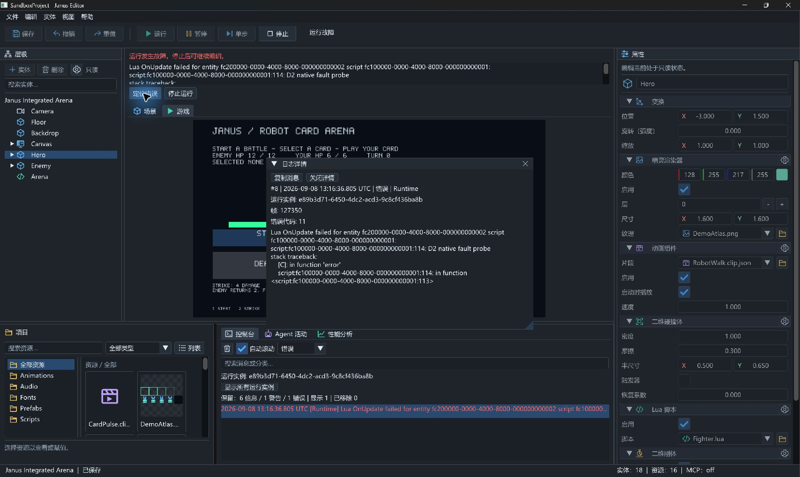
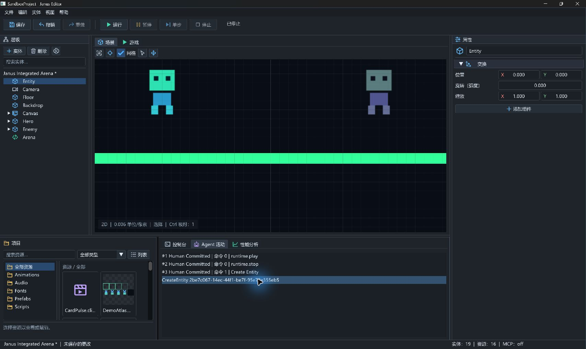
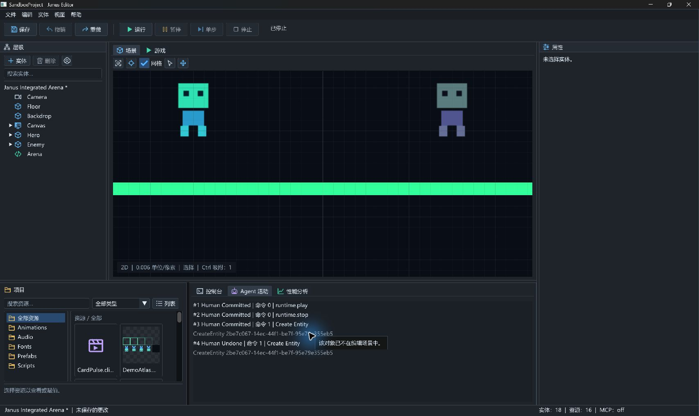

# D2 日志、故障入口与示例按钮验收

日期：2026-09-08。按用户“先完成 D2，验证后收口”执行；E/F 未启动。
工作分支 `codex/editor-diagnostics`，起点 `c745a5cf7009430d720b767ee14a1fa3e32adab0`
（包含 D1）；本文记录未提交工作树的本地验证，不代表 main 已集成或 v0.10 发布。

## 交付与集成

核查 main / origin/main 为 `1b496c197ef53d6a29c6b627193c938117cd02f2`。
#97 于 12:38:44 UTC 合入 main，包含 B/C；[合并后 CI](https://github.com/ULookup/Janus/actions/runs/34227248146)
成功。#98 于 12:38:53 UTC 合入 `codex/editor-move-gizmo`，合并提交
`2e12ccf45c3bf874d9bbe3d0adbcfcfddaa48c0e`；D1 尚未进入 main。
后续交付 D2 时须包含 D1，不能把 #98 的 MERGED 状态当作 main 集成证据。

- Console 从既有 LogStore 分页读取全部有界留存记录，展示 UTC 毫秒时间、分类、等级计数、
  搜索和丢弃数量；等级计数表示筛选前留存数量，Showing 表示筛选后数量。
  搜索覆盖消息和分类，ASCII 不区分大小写，其他 UTF-8 字节按原文匹配。
- 日志按 sequence 选择，可调整大小的详情窗口显示完整消息、runtime UUID、帧、错误码与
  截断标识，支持复制消息。筛选/清空/淘汰后重新解析身份，不保留已经失效的详情副本。
- Faulted 横幅提供 Locate error 与 Stop runtime；定位匹配该次运行的原始故障消息，
  后续被拒绝的 Pause/Step 日志不会替换故障定位。Stop 经 ProjectSession，成功后恢复编辑。
- Activity 效果行按 UUID 解析当前 EditorScene，提交有效 Inspector 草稿后选择并聚焦；
  已不存在的实体禁用并解释原因。Profiler 保留既有 CPU 标签与未采样空状态，无 GPU 推断。
- Combat.lua 统一阶段可用性和动作守卫。菜单仅 Start，战斗可选牌/Restart，选牌后可 Play，
  胜负后仅 Restart。无效键盘/按钮/规则入口在音频、动画及 Arena 反馈前返回。
  Engine 只增加通用 Lua `set_button_interactable(bool)`，不包含战斗规则。

设计 §6 的 `Button.enabled` 改为既有 `Button.interactable`：前者关闭整个按钮绘制，
后者保留 disabledColor 背景并禁用交互，符合本包阶段提示目的。Scene 格式与 MCP 名称不变。

## 测试先行与发现的回归

先增加 Console 跨页计数/筛选、日志元数据与淘汰测试，再实现 Read/SetSearch 接口；
初始编译因接口尚不存在失败。新增 Lua 类型/缺组件检查和 Combat 阶段测试，扩展热重载及
Faulted 日志/Stop 测试。首次故障断言揭示“最后一条日志”可能是拒绝 Step；随后改为匹配
原始错误，同时修正 Console 的错误定位逻辑。

原生点击发现 D1 `036f7e4` 的 `!ImGui::IsAnyItemActive()` 会在 ImGui 背景按住期间拒绝
Game View 输入。NoMove 窗口仍持有背景 MoveId，导致按钮捕获取消；短促模型输入未覆盖此情况。
新增真实 ImGui context 的帧测试，依次输入按下、保持、释放：旧条件在保持帧失败，修复后通过。
`EditorGameInput.h` 在 Image 后使用 IsItemHovered 与文本/Inspector 所有权，保持其他控件捕获
隔离。测试使用现有 JanusImGui，不新增第三方依赖或 Core/Editor 分层依赖。

## 自动验证

在 Visual Studio Developer PowerShell（MSVC 14.38、x64）执行：

```powershell
cmake --preset windows-msvc-debug
cmake --build --preset windows-msvc-debug
cmake --preset windows-msvc-debug-tests
cmake --build --preset windows-msvc-debug-tests
./out/build/windows-msvc-debug-tests/Tests/JanusTests.exe '[d2],[combat],[reload],[runtime-session]'
ctest --preset windows-msvc-debug-tests
git diff --check
```

两个 preset 配置、构建成功。定向测试 **19 cases / 603 assertions** 通过；最终 CTest
**487/487，0 failures，38.06 秒**。期间早一轮 486/486 是新增 ImGui 回归测试前的记录，
最终数目以上述 487 为准。最终增量构建无错误；早期完整构建出现既有 McpEditorHostTests.cpp
的 C4834 警告，配置的可选 PkgConfig/LibUSB 缺失不阻断生成。

生产 Editor 的实际 stdio/窗口宿主也执行两种协议，均返回成功：

```powershell
$env:JANUS_EDITOR_PREFERENCES_PATH = Join-Path $PWD 'out/d2-mcp-preferences.json'
python -X utf8 Tests/MCP/integrated_external_e2e.py --host out/build/windows-msvc-debug/Editor/JanusEditor.exe --project Game --era modern --native-editor
python -X utf8 Tests/MCP/integrated_external_e2e.py --host out/build/windows-msvc-debug/Editor/JanusEditor.exe --project Game --era legacy --native-editor
```

两轮都完成 authoring、rollback、reopen、480 个中性 Step、胜利/失败及共享 diagnostics。
日志位于忽略目录 `out/d2-focused-final.log`、`out/d2-final-debug-build.log`、
`out/d2-final-tests-build.log`、`out/d2-final-ctest.log`、`out/d2-native-modern.log`、
`out/d2-native-legacy.log`。这些日志不是提交资产。

## 原生交互

使用本机 Windows Editor 与 Game 副本；副本置于
`out/d2-native-60fa96c8b7d142d0b32a3e644a98799f/SandboxProject`。
原生测试可执行文件 SHA256：
`E40D2ED00346AE7AE98C997042C497C849806DF989BADD391381927C67DBD9D1`。
该文件包含最终行为修复，随后仅做 C++ 格式整理并重新构建/完整测试；两种生产 stdio 使用
重新构建后的 Debug 可执行文件。截图尺寸为工具返回的窗口图像尺寸，不冒充显示器物理分辨率。

| 操作 | 实际观察 |
| --- | --- |
| 中文界面，普通窗口 963×631 与最大化 1707×1019 | 日志分类/计数可见；原紧凑内嵌详情高度不足，改成独立可调整窗口并复验完整堆栈 |
| 鼠标 Start → Strike → Play，重复三次 | 敌方 HP 12→8→4→0，玩家 HP 2，回合 3；胜利后只有 Restart 可用 |
| 胜利后点 Strike，再点 Restart | 无额外结算；Restart 恢复菜单、HP 12/6、回合 0，Start 恢复可用 |
| 只在测试副本 OnUpdate 注入 error | 热重载后 Faulted 保留现场，横幅显示错误；Locate error 打开原错误详情与运行筛选 |
| 详情 → 关闭详情 → Stop runtime | 完整时间/分类/UUID/帧/错误码/堆栈可读；停止后返回作者态，正常编辑可用 |
| 创建临时 Entity，选 Hero，再点 Activity UUID | 选择回到 Entity，Scene View 聚焦；没有绕过命令修改实体 |
| Undo 创建，再点旧 Activity 行 | 旧行禁用，显示“该对象已不在编辑场景中”，不选择其他对象 |
| Alt+F4 关闭副本 | 未保存提示可达，放弃本轮临时修改后退出；未改写源 Game 场景 |







测试副本脚本已恢复，临时创建实体未保存；本轮生成的根目录 imgui.ini 与原本不存在的用户
偏好文件在退出后清理。自动与原生证据共同覆盖 D2；本轮未实机重走三次 Wait 失败，失败规则
由完整回归与两种生产 stdio 验证覆盖。复制到系统剪贴板的实际内容未单独验收。

## 后续边界

D2 本地实现与验证完成，尚无 D2 提交/PR/CI。E 文件生命周期、F Release/安装包、目标设备、
多屏/系统 DPI 全矩阵、人工试听及首次用户验收仍保持待办。此次不扩大 PRD 范围，不关闭
PM-01 的完整退出矩阵，不更改版本号，不声明 v0.10 发布或 v0.11 完成。
