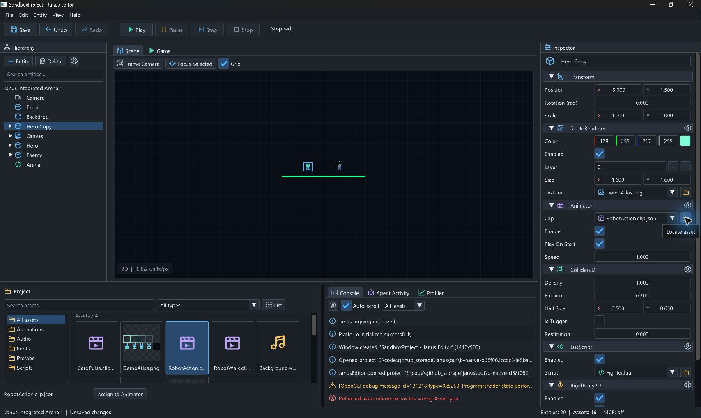
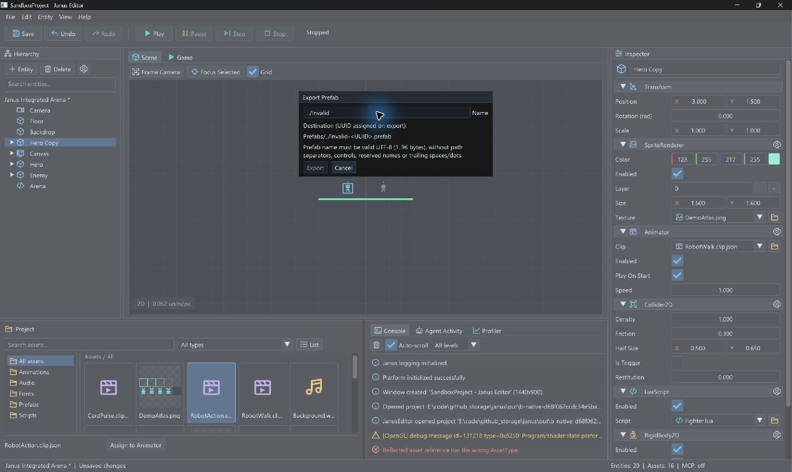
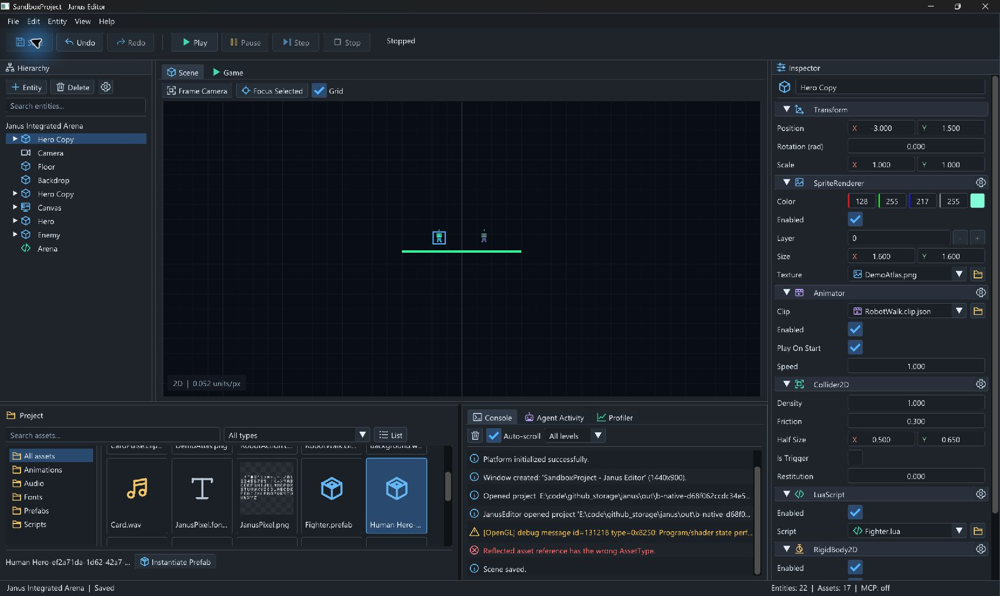
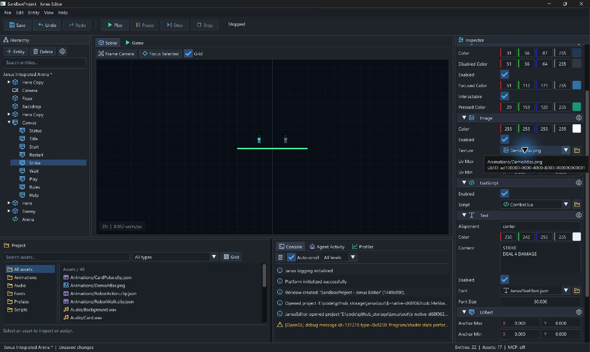

# B 包：Duplicate 与资源工作流验证

日期：2026-09-08；基线 `df00a14bf4644304e2154eec60e70a6fa9c19cb9`。
初次本地验证在包含 A/B 两包的 `codex/editor-safe-close` 工作区执行。
提交时已拆分：A 包为 PR #95；B 包位于 `codex/editor-duplicate-assets`，以 A 包分支为基线。
拆分恢复后逐文件核对，与下述已验证的 A+B 代码快照一致；CI 和合并状态以 GitHub PR 为准。
本文记录本地实现与本机验收，不是 v0.10 发布声明。

## 实现与契约

- `DuplicateEntityCommand` 从活动 ReflectionRegistry 捕获子树，复用 Prefab 的有界验证、
  UUID 重映射、插入检查及 Undo 预留估算。上限 1024 实体 / 64 层；不经过文件或第二套组件编码。
  非根副本在同一父节点中紧跟原对象，根继续按 UUID 排序。根名称追加 ` Copy`，
  子节点名称、局部值与 AssetReference 保留；Redo 使用原快照和原复制 UUID。
- Human Entity 菜单、Hierarchy Organize 菜单及 Ctrl+D 调用 EditorActions；MCP 新增
  `scene.duplicate_entity`，分类 SceneWrite，走原 owner-thread dispatcher、权限和事务入口。
  多主 Camera、第二个/嵌套 Canvas 整体拒绝；恢复失败清理新实体，不改变原树。
- Inspector 六类资源槽保留类型筛选和 None，增加名称搜索、Locate 和拖入。
  Grid/List 拖拽携带资产 UUID 与 ProjectSession 身份，不携带 registry 元素指针；
  ProjectSession 重开即更换身份。错误类型、已失效/其他项目 payload 拒绝，原值不变。
  Locate 清理资源筛选、选择并滚动到资源，小窗口会切到 Project 页签，实体选择不变。
- Human Export Prefab 弹窗默认实体名称，预览 `Prefabs/<name>-<UUID>.prefab`，成功自动定位。
  `ProjectSession::ExportPrefab` / MCP `scene.export_prefab` 接受可选名称；省略仍是旧 UUID 文件名。
  名称为 1–96 字节 UTF-8 文件名片段，拒绝路径分隔/跳转、ASCII/C1 控制字符、非法 UTF-8、
  Windows 保留名和尾随点/空格，不静默清洗名称。
- FileSystem 原子写增加 CreateNew 模式；Windows 使用不带 REPLACE_EXISTING 的 MoveFileExW，
  其他平台用同目录 hard-link 发布。默认 Replace 不变。Registry 保存失败只清理本次新文件，
  成功后才发布内存 Registry。Registry JSON、路径搜索与资源 UI 显式使用 UTF-8，避免中文名依赖 ANSI 编码。

主要入口：
[共享命令](../../Engine/Scene/Command/EntityCommands.cpp)、
[EditorActions](../../Editor/EditorActions.cpp)、
[导出](../../Editor/ProjectSession.cpp)、
[资源面板](../../Editor/Panels/AssetBrowserPanel.cpp)、
[Inspector](../../Editor/Panels/InspectorPanel.cpp)、
[MCP 工具](../../MCP/Tools/SceneTools.cpp)。

## 自动验证

Visual Studio 2022 Developer PowerShell，MSVC 14.38、Windows x64，使用仓库 Debug presets。

```powershell
cmake --preset windows-msvc-debug
cmake --build --preset windows-msvc-debug --parallel 2
cmake --preset windows-msvc-debug-tests
cmake --build --preset windows-msvc-debug-tests --parallel 2
$env:SDL_AUDIO_DRIVER='dummy'
out/build/windows-msvc-debug-tests/Tests/JanusTests.exe '[duplicate],[asset-workflow],[prefab]'
ctest --preset windows-msvc-debug-tests
python Tests/MCP/integrated_external_e2e.py --host out/build/windows-msvc-debug/Editor/JanusEditor.exe --project Game --era modern --native-editor
python Tests/MCP/integrated_external_e2e.py --host out/build/windows-msvc-debug/Editor/JanusEditor.exe --project Game --era legacy --native-editor
git diff --check
```

两套 configure/build 成功，定向测试 **19 个用例 / 1747 条断言通过**；最终 CTest
**439/439、0 失败、34.84 秒**，完整读取 883 行日志并核对 439 条通过结果。
`git diff --check` 通过，构建输出/临时项目保持忽略，仓库 Game/SandboxProject 无改动。
新增 12 个 Catch2 用例；覆盖父子顺序、不可变 Redo、
Camera/Canvas 拒绝、实体/层数/事务字节上限、活动 Reflection 恢复失败补偿、
六类资源槽类型与项目身份校验、None/Undo/Redo/保存重开、英文/中文命名、Registry 补偿、
已有文件不可覆盖及 8 个并发创建者只能有一个成功。

生产 JanusEditor modern/legacy stdio 均通过：事务内实例化与 Duplicate、失败回滚、
命名导出和查询、保存重开、Runtime 写入拒绝、480 次中性 Step、胜败结果和诊断。
测试脚本扩展原 integrated_external_e2e，不引入第二个生产 handler 或模拟输入。

完整日志保留在忽略的 `out/b-*.log`。已存在的 `getenv` C4996、McpEditorHostTests C4834
警告仍在；configure 的可选 PkgConfig/LibUSB 未找到，不影响 Windows 构建。没有新增依赖。

## 原生界面验收

通过 computer-use 的 `@oai/sky` 操作本机 SDL/OpenGL JanusEditor；使用 `out/b-native-*/SandboxProject`
中的 Game 副本和当前 Debug 可执行文件。测试窗口先默认尺寸，后最大化；没有改写仓库 Game 文件。

1. 选择 Hero，Ctrl+D 得到并选中 Hero Copy；实体数 18→20，包含原子节点。
   Ctrl+Z 回到 18，Ctrl+Y 回到 20。选中副本后 Inspector 保留 Transform、Sprite、Animator 等值。
2. 将 Grid 的 RobotAction.clip.json 拖入 Animator.clip，字段由 RobotWalk 改成 RobotAction。
   将 DemoAtlas.png 拖到同一槽，Console 报 wrong AssetType，原动画保持。
   点击 Locate 后资源卡被选中且滚动定位，Hierarchy/Inspector 仍选中 Hero Copy。
3. 打开 Animator 下拉，输入 `Walk`，仅保留匹配的 RobotWalk 和 None，选择后字段正确切换。
4. 从 Organize 打开 Export Prefab，默认 Hero Copy；输入 `../Invalid` 时显示原因并禁用 Export。
   改为 `Human Hero`，导出后自动选中新增资源，资源数 16→17；Instantiate 后实体数 20→22。
5. 保存、Alt+F4 退出、重开，仍为 Saved / 22 实体 / 17 资产。
   磁盘检查确认两个 Hero Copy 根有不同 UUID，且动画引用保持；新注册文件为
   `Prefabs/Human Hero-ef2a71da-1d62-42a7-9659-413a1acb1e09.prefab`。
6. 给副本中的 Strike 增加 Image；Grid 拖入 DemoAtlas.png 成功，选择 None 清空，
   切 List 后再次从列表拖入成功，保存成功。测试窗口已正常退出。






## 边界与后续

- B1/B2 本地实现与上述自动/原生路径完成；PM-05/06 的资源赋值和可识别导出缺口已有本机证据。
  正式合并/CI、目标 DPI 矩阵和首次用户试用仍归后续发布验收，不把这些截图当成全平台验证。
- 中文文件名存储/查询已测；完整中英界面及中文字形覆盖属于 D1，当前默认字体仍有覆盖限制。
- POSIX CreateNew 实现未在本轮 Windows 环境运行。进程在新文件与 Registry 提交之间崩溃仍可能
  留下未注册文件；不增加跨文件事务保证。保持不支持关联 Prefab/Override/运行时生成。
- A 包 PM-01 的完整未保存退出矩阵不因本轮已保存 Alt+F4 验证而提前关闭。
  C–F、Release/目标设备性能及发布流程仍待实施。
