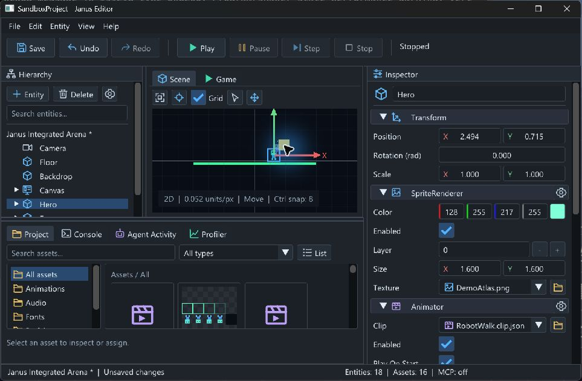
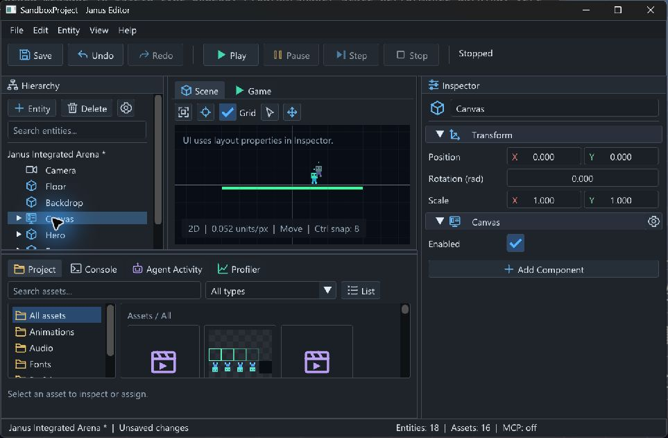
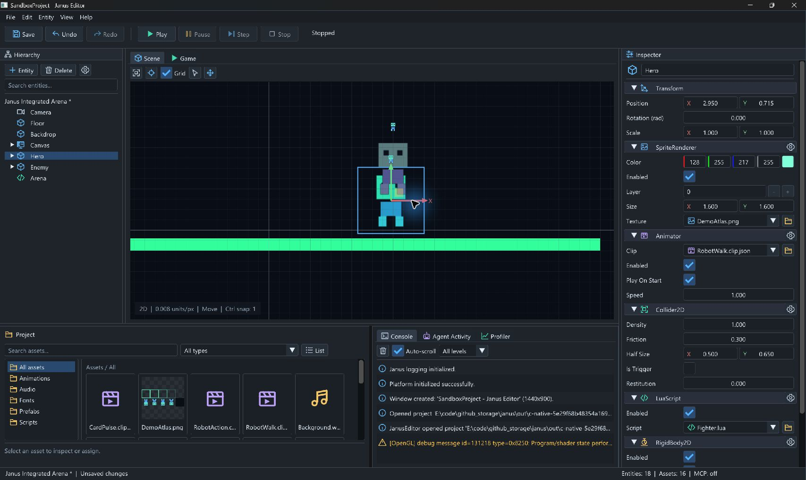

# C 包：Scene View Move Gizmo 验证

日期：2026-09-08。开发分支 `codex/editor-move-gizmo`，C 包实现为未提交工作区。
完整依赖基线为 `59387eb0a03507207a9808610e9e8cfd8da152a8`：将 main 的 #95 与
`codex/editor-safe-close` 中已合并的 #96 集成到本地开发分支。
核查时 main 是 `2fcfeab`；#96 的目标为 A 分支，其 B 包内容尚未进入 main。
本文记录本地证据，未创建 C 包 PR，也不声明 v0.10 发布。

## 实现契约

- Scene View 提供 Q/Select、W/Move、世界 X/Y 箭头和 XY 平面手柄；旋转/缩放继续使用
  Inspector。UIRect/Canvas 不接受移动，视图明确提示使用布局属性。默认窄窗口与最大化
  使用紧凑图标工具栏，工具提示保留名称/快捷键，视图显示当前模式与 Ctrl 吸附间距。
- `EditorTransformDrag` 仅保存 UUID、会话身份、Scene revision、authoring generation、
  local 父链、相机和显示矩形等值。先将 UI 指针映射到实际 target 像素，再转换到世界点；
  世界 delta 经轴约束及可选 Ctrl 吸附后，用完整父链仿射矩阵的逆求 local position。
  支持旋转与非均匀缩放的组合；拒绝非有限与近奇异矩阵。零位移精确保留原 local 值。
- `ScenePose::Resolve` 从 local 字段计算只读姿态，验证缺失父链、循环与非有限值。
  `SceneRenderRequest.positionOverride` 默认空；预览使用 scratch pose 表，后代跟随，
  不写 Transform 的 local、world cache 或 dirty。普通渲染保留原缓存更新和 Sprite
  rotation/scale 的剪切近似表达，Game View 不接收 override。
- Human 松手通过 `EditorActions::CommitTransformDrag` 调用共享条件提交入口，最后
  原子检查 revision/generation，成功仅执行一条 `SetPropertyCommand`。预览不进入历史、
  序列化、克隆或 MCP 资源。取消和零位移不提交；失败清理预览并保留错误。
- 项目/Scene 替换、任意作者修改、Undo/Redo、实际事务回滚/恢复、Runtime 启动使旧预览
  失效。generation 是不透明单调失效标记，不是命令计数；既有额外 MarkDirty 通路也推进它。
  Runtime 成功启动会推进该标记而不改变 dirty/history，覆盖同一次 MCP Pump 内 Play→Stop。
  仅 Commit 分组、Save、settings save 不增加它；条件拒绝不触发 Agent 事务补偿或过期清理。
- Esc、窗口失焦/resize、相机导航、显示矩形/DPI 改变、切视图、选择改变、模态、资源拖拽、
  Runtime/事务/recovery/关闭保护均取消捕获。捕获过的输入在释放前隔离于 Game 输入；
  文本字段优先。网格、选中框、手柄共享更新后的相机及 display/target 比例。

入口：[拖动模型](../../Editor/EditorTransformDrag.h)、
[原生交互](../../Editor/EditorSceneInteraction.cpp)、
[条件提交](../../Editor/ProjectSession.h)、[只读姿态](../../Engine/Scene/ScenePose.h)。
本包对应 PRD Scene View 的 Move 与 R5；PRD 将通用 Snapping 列为后续功能，已确认的
本次设计只包含 Ctrl 世界位移网格吸附，不扩展为通用吸附系统。

## 自动验证

从 Visual Studio Developer PowerShell 执行：

```powershell
cmake --preset windows-msvc-debug
cmake --build --preset windows-msvc-debug --parallel 2
cmake --preset windows-msvc-debug-tests
cmake --build --preset windows-msvc-debug-tests --parallel 2
out/build/windows-msvc-debug-tests/Tests/JanusTests.exe '[move],[gizmo],[authoring-generation]'
ctest --preset windows-msvc-debug-tests
python Tests/MCP/integrated_external_e2e.py --host out/build/windows-msvc-debug/Editor/JanusEditor.exe --project Game --era modern --native-editor
python Tests/MCP/integrated_external_e2e.py --host out/build/windows-msvc-debug/Editor/JanusEditor.exe --project Game --era legacy --native-editor
git diff --check
```

- 两个 Debug preset configure/build 均成功。新增测试先于对应行为实现写入；首次集成构建
  发现拖动测试缺少 SceneReflection 头文件，修复后完整构建通过。
- 定向测试 **23 cases / 791 assertions** 通过；全量 **462/462，零失败，39.46 秒**。
  已读取完整结果并核对 462 条 Passed 记录。基线 A+B 为 439 项，本包新增 23 项。
- 测试覆盖完整父链/剪切、world delta 吸附与释放 Ctrl、不同显示与 target 尺寸、单次 Undo/Redo、
  序列化/克隆不变、真实提交渲染顶点及所有 Transform 缓存不变、无效矩阵/循环、取消/零位移、
  跨项目/Scene 替换/实体删除、相机/resize/DPI 改变、Agent 修改后 Undo、事务/recovery、Play→Stop。
- Live MCP 测试在 Human 预览中通过真实 owner-thread Pump 读取两次原 position；Agent 修改
  另一实体后 Human 提交拒绝，Agent 新值和唯一新增历史保留，可正常 Undo。
- 原生生产 stdio 的 modern/legacy 集成均通过：作者修改、事务回滚、重开、480 次
  中性 Step、胜负两结果和诊断读取；stdout 保持协议用途。
- 构建仍有既有 C4996 getenv、C4834 未使用 Result 警告；未引入依赖。
  首次直接从普通 PowerShell 调用 ctest 时 PATH 未加载，随后在 Developer PowerShell 正常完成。
  日志保留于忽略的 `out/c-*.log`。

## 原生交互证据

使用独立 Game 副本 `out/c-native-5e29f68b48354a169ae74447d50f64cc/SandboxProject`，
运行实际 JanusEditor.exe。源 Game/SandboxProject 未被写入。Windows/MSVC Debug/OpenGL，
项目逻辑分辨率 1280×720；工具截图尺寸默认 963×631、最大化 1707×1019，不能将这些
截图坐标直接当成显示器物理像素或完整 DPI 矩阵。

1. 选择 Hero，W 进入 Move，拖 X：`(-3, 1.5)` → `(0.92441845, 1.5)`；一次 Ctrl+Z
   恢复 `(-3, 1.5)`，一次 Ctrl+Y 恢复移动结果。Ctrl+S、Alt+F4、重开后同 UUID
   `fd200000-0000-4000-8000-000000000011` 保持该位置，Inspector 与磁盘 Scene 一致。
2. 修复默认窄窗口下 Move 按钮被旧长标签挤出的问题；新版可直接点击 Move 图标。
   Y 拖动保持 X 不变：Y `1.5` → 约 `-0.070`；平面拖动同时改变两轴到约 `(2.494, 0.715)`。
3. 选择 Canvas 时手柄消失，并显示布局属性提示。
4. 最大化、Focus Selected 后手柄/选中框与角色对齐；X 再次拖动到约 `(2.950, 0.715)`，
   Y 保持不变，保存成功。子对象跟随同时由原生画面与自动渲染顶点测试覆盖。





## 边界与后续

本机原生验证不替代目标设备、多屏及 100/150/200% 系统 DPI 全矩阵。自动测试验证
Ctrl 吸附、Esc 所调用的取消模型、失焦/resize 的失效条件；未将这些模型测试描述为
已执行完整原生中途按键/失焦组合。原生 Console 可见 OpenGL shader state 性能提示，
没有将其视为 GPU 基准或发布性能保证。

C 包实现和本地回归完成后，D1 偏好/双语/属性、D2 诊断、E 文件生命周期、F Release
仍待实施。PM-01 完整原生关闭矩阵、目标 DPI 和首次用户验收仍保留，不自动关闭发布出口。
