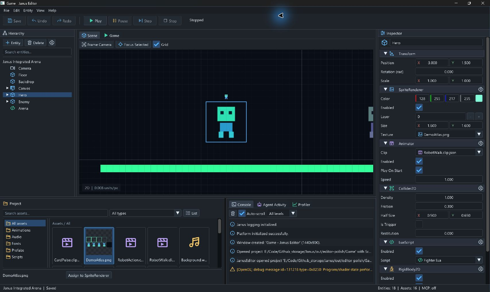

# 编辑器视觉优化与原生验收

日期：2026-09-08。实现基于 `bbd93dc`；PR #93 合并后，从内容相同的 `a9a5079` 建立
交付分支 `codex/editor-visual-polish`。
用户限定本轮只优化纯编辑器效果；未修改 Game/SandboxProject 场景、美术或脚本，未新增操纵器。

## 交付效果

- 主字体从 16 调整为 17；统一中性深灰面板、输入框边界、标签页和悬停/选中状态。
- 工具栏高度从 94 调整为 80；保存/历史与运行操作有分隔线，按钮占位稳定。
  窗口标题包含项目目录名；没有复制参考图中的版本或连接状态。
- 默认 Hierarchy/Inspector 宽度为 260/390，底部高度为 300，继续受紧凑布局边界约束。
  Hierarchy 的组织/Prefab 操作收入齿轮弹层，减少常驻行数。
- Inspector 保留真实反射字段与命令语义，显示友好字段名、旋转 rad 单位、宽度足够时的 X/Y 标识、
  资源类型图标和可点击的组件菜单。轴标是显示叠加；编辑时让出数值输入区。
- Project 使用方形预览区、真实尺寸等比缩放、透明棋盘底和整卡选中边框。
  文件名按 UTF-8 边界省略，完整名称/类型在提示中；保留键盘导航。
  资源名称与现有赋值操作排列在同一底栏，选择资源不再挤压列表三行。
- Console 使用单行消息摘要、轻微交替行底色及严重度图标/颜色；悬停查看完整日志，保留等级过滤。
- Scene 网格增加细分线，缩放提示移到左下角，避免窄窗口工具栏截断。
  Editor 专用清屏色调整；已有场景背景 Sprite 仍正常覆盖它，不修改内容来制造视觉差异。

## 边界

新增只读 `Renderer2D::GetTextureSize`，返回 Janus Viewport 宽高，不暴露后端类型。
尺寸来自已有创建参数；普通纹理随 Destroy 失效，RenderTarget 附件沿用现有目标记录。
不进行 GPU readback、不重复加载图片、不新增 GPU 资源或依赖。
新增自动测试先于此查询实现，覆盖创建失败、未知句柄、销毁与附件 Resize/Destroy 后的尺寸失效，
以及纵向/正方形/宽图集在预览框内保持比例与居中。

Human 修改仍经 EditorActions/ProjectSession/共享命令。字段展示名不改变 Scene v1 名称、
属性类型或单位；MCP、运行逻辑、项目资产格式均未改变。

## 验证

Visual Studio Developer PowerShell，MSVC 14.38：

```powershell
cmake --preset windows-msvc-debug
cmake --build --preset windows-msvc-debug --parallel 2
cmake --preset windows-msvc-debug-tests
cmake --build --preset windows-msvc-debug-tests --parallel 2
& out/build/windows-msvc-debug-tests/Tests/JanusTests.exe '[preview],[workspace]'
ctest --preset windows-msvc-debug-tests --output-on-failure
git diff --check
```

两套配置和构建成功，定向 6 cases / 283 assertions 通过。
最后两处纯 UI 收尾（卡片键盘导航标志、操作栏留白）重新完成两套构建及原生截图核对；
提交 PR 前，对最终代码补跑全量 CTest：417/417、零失败、50.85 秒。
编译仍有既有 getenv C4996 警告；配置仍提示可选 PkgConfig/LibUSB 缺失，未声称零警告构建。

原生检查使用 `out/editor-polish/Game` 副本，工具返回紧凑 963×631、最大化 1707×1019 截图。
已观察：对象选择联动 Inspector；组件齿轮打开 Remove Component，Esc 取消；
拖动 Position X 后 Ctrl+Z 恢复值，Ctrl+S 保存副本；等比图集和整卡选择；
Play/Pause/Stop 的状态、禁用样式与返回 Scene；Focus Selected；最终操作栏无多余外层滚动条。
Undo 后 dirty 仍保留属于既有契约（已有专门测试），本轮未改为保存点追踪。
预览最后 Saved/Stopped，截图导出后关闭；测试产生的根目录 imgui.ini 收到忽略目录，不纳入交付。

本轮未做多显示器 DPI 切换、完整 100/150/200% 矩阵、Release/GPU 性能验证。
原生日志仍包含 OpenGL shader recompilation 性能警告；该警告没有被隐藏或当作性能验收通过。
日志、验证脚本与项目副本位于忽略目录 `out/editor-polish/`。


