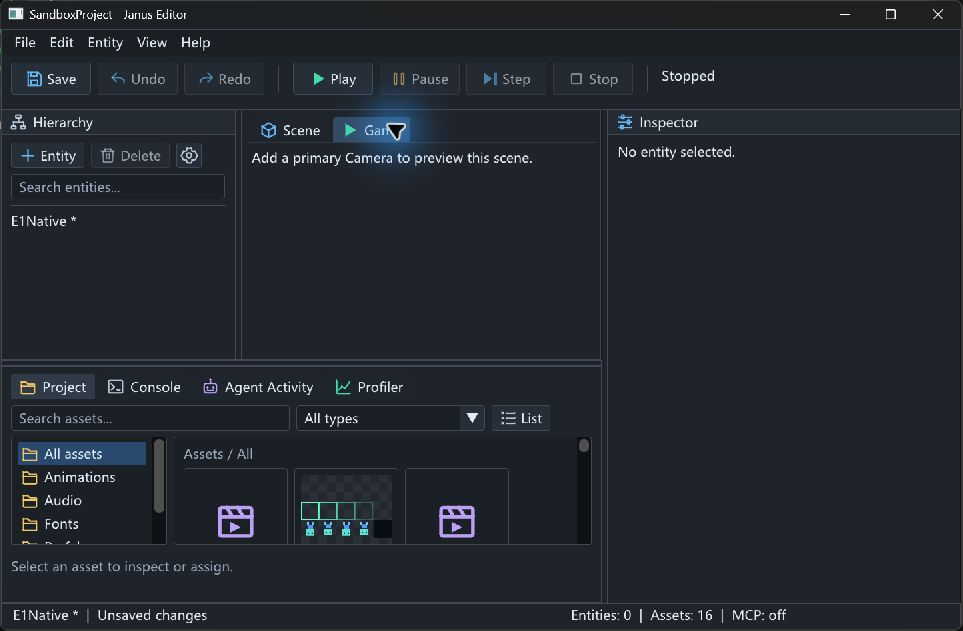
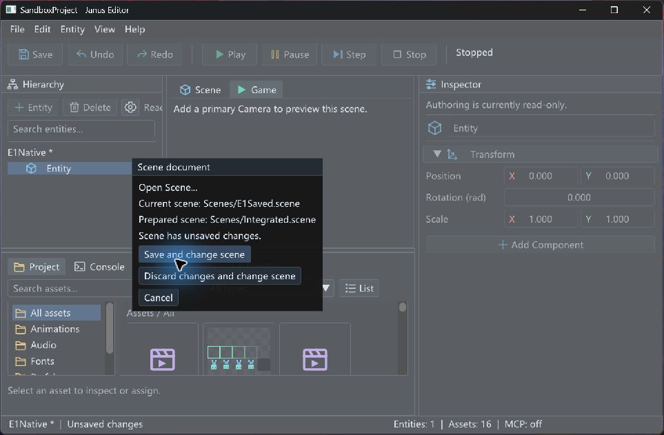
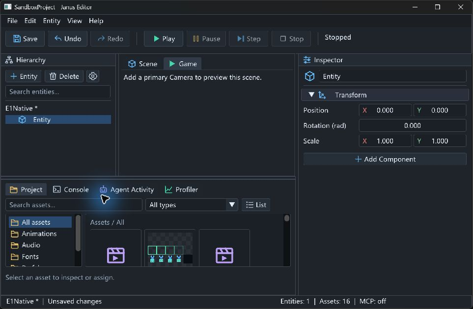
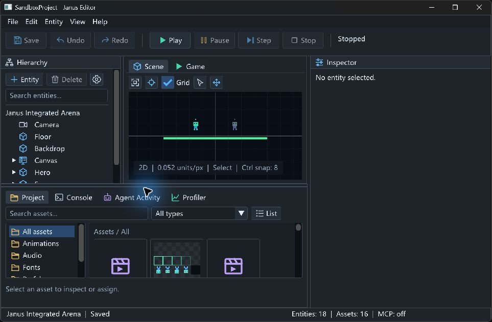

# E1 场景文档生命周期验证

日期：2026-09-09（北京时间）。E1 已本地完成；E2/F、完整 PM-01 出口、Release/目标设备/
系统 DPI/首次用户验收仍待完成，v0.10 未发布。

## 基线与范围

- 工作区：`codex/editor-scene-documents`，HEAD `c745a5cf7009430d720b767ee14a1fa3e32adab0`。
  从 D1 基线保留全部 D2 未提交工作后继续 E1；D2/E1 均尚未提交、建 PR 或合入 main。
- 本日 `git ls-remote origin refs/heads/main` 再核查为
  `1b496c197ef53d6a29c6b627193c938117cd02f2`，包含 A/B/C。D1 的 #98 合入 C 分支，
  不等于已进入 main。已成功的 main CI 证据见 [项目状态](../project-status.md)。
  本文的本地结果不能作为尚不存在的 E1 PR CI。
- 按 [发布准备设计 §7.1–7.3](../superpowers/specs/2026-09-08-v0.10-release-readiness-design.md)
  完成单活动 Scene 新建/打开/另存、受保护替换和 MCP 请求绑定；没有开始项目欢迎页或分发。

## 实现与失败边界

`ProjectSession` 持有当前路径和 `hasSavedFile`。不透明 `PreparedScene` 包含项目身份、
Scene revision、authoring generation、候选 Scene 和来源内容。Open 使用 active ReflectionRegistry
反序列化，检查所有序列化 AssetReference 的注册身份及类型。准备失败保留旧文档；提交前重查
路径、来源内容、身份和约束。资源检查不加载 GPU 内容，不代替 Runtime 的脚本/资源验证。

Human File 菜单先准备候选，再由既有 `EditorCloseController` 持有离开保护：保存并切换、
丢弃并切换、取消；Runtime 要求明确 Stop，活动事务要求明确结束或回滚。普通 New/Open
遇 dirty/read-only 拒绝，无公开 `ignoreDirty` 参数。Inspector 草稿沿用 D1 的提交/显式丢弃规则；
同项目的 Project Settings 草稿保留。已执行的 Stop 或成功旧场景保存不会因随后失败而逆向恢复。
例如打开当前同路径并选择保存，保存改变候选来源内容时会要求取消并重新准备，避免打开旧快照。

New 只预定项目内路径，不写磁盘；空场景为 dirty，没有 Camera 时 Game View 给出添加提示。
首次 Save 使用既有 create-only 原子写入，目标被占用不会覆盖。SaveAs 默认 create-only，明确
overwrite 才替换；写成功后才更新路径与保存标记，保留 UUID/历史/选择，不改 `project.defaultScene`。
后续 Undo 保持既有保守 dirty 语义。未首存文档的 discard/recovery 直接重建空 Scene，即使预定
路径后来被目录占用也不读取它，可继续另存。所有写入仍受 Runtime/transaction/recovery guards 约束。

路径经 `ResolveProjectPath`，限制为项目内 `.scene` 普通文件，拒绝越界、目录、错误扩展名；
父目录必须存在，界面明确提示先创建目录，不隐式创建文件夹。链接解析沿用项目路径规则；
不承诺跨进程文件锁或抵抗恶意并发替换链接。命令先于其借用的旧 Scene 释放，替换增加 revision/
generation，Editor 在下一次面板使用前清选择、草稿、拖动预览和旧 Game 输入，重置首次取景。

新增 MCP `scene.new` / `scene.open`（SceneWrite）与 `scene.save_as`（SceneSave），接受 path、
可选 expectedRevision，SaveAs 另接受显式 overwrite。生命周期参数不允许 transaction，失败不
偷偷补偿 Agent 事务。每次 owner-thread 路由前刷新 Scene 绑定；注册集完整准备后交换，不能在
活动 handler 内销毁其 registry。同一次 Pump 中切换前排队的请求按 binding epoch 拒绝，重新
读取上下文后可正常调用。scene/current、project/info 补充 scenePath、hasSavedFile、
sceneRevision、bindingEpoch。IO worker 不访问 Scene，生产 stdio 仍只向 stdout 写协议。

## 自动验证

Visual Studio Developer PowerShell，MSVC 14.38 x64，Windows 10.0.26100，两个仓库 Debug preset。
先添加生命周期测试，初次构建因未实现 API 失败；随后定向通过再扩展外部协议验证。
中文首存冲突最初使生产错误响应超时：FileSystem 诊断使用 Windows 本地编码 path.string()，
JSON 无法序列化。新增 UTF-8 错误测试先得到 2 条失败断言，改为既有 PathToUtf8 后通过。
最后新增“未首存路径被目录占用”的恢复测试，先在 discard 断言失败，修复后通过。

```powershell
cmake --preset windows-msvc-debug
cmake --build --preset windows-msvc-debug
cmake --preset windows-msvc-debug-tests
cmake --build --preset windows-msvc-debug-tests
./out/build/windows-msvc-debug-tests/Tests/JanusTests.exe '[e1]'
ctest --preset windows-msvc-debug-tests -R 'MCP.SceneDocuments'
ctest --preset windows-msvc-debug-tests
git diff --check
```

结果：两个 preset 配置/构建成功；定向 **9 用例、144 断言**；全量 **498/498，零失败，37.14 秒**。
全量结果逐项读取，包含两种 SceneDocuments 外部测试、既有 Combat/Integrated/Physics/Prefab
与 D1/D2 回归。最初完整构建有既存 McpEditorHostTests 的 nodiscard 警告，无构建失败；SDL
可选 PkgConfig/LibUSB 未找到不阻止当前 Windows 配置。新增代码没有引入依赖或生成源修改。

覆盖旧对象/路径/dirty/history 保留、首存碰撞、SaveAs 不覆盖及历史保留、UUID 重开、来源变化、
候选过期、未知资源、Runtime Stop、事务隔离、同 Pump 旧请求拒绝、UTF-8 失败响应和无磁盘恢复。
使用既有 FakeRenderDevice fixture，未增加另一套生产 handler 或输入注入。

生产 Debug Editor 另运行同一流程：

```powershell
$env:JANUS_EDITOR_PREFERENCES_PATH = Join-Path $PWD 'out/e1-mcp-preferences.json'
python -X utf8 Tests/MCP/scene_documents_external_e2e.py --host out/build/windows-msvc-debug/Editor/JanusEditor.exe --project Game --era modern --native-editor
python -X utf8 Tests/MCP/scene_documents_external_e2e.py --host out/build/windows-msvc-debug/Editor/JanusEditor.exe --project Game --era legacy --native-editor
```

**modern / legacy 均通过**：无效 Open 不换文档、New 不写文件、dirty Open 拒绝、首存冲突保留
占用文件、中文 SaveAs/重开保持 UUID、默认拒绝覆盖、事务内生命周期拒绝且事务仍 Active、
显式覆盖后 defaultScene 与原始场景文件不变。每次使用临时 Game 副本；日志在忽略的 `out/`。
最终主要日志：`e1-configure-debug.log`、`e1-configure-tests.log`、`e1-recovery-debug-build.log`、
`e1-recovery-tests-build.log`、`e1-recovery-focused.log`、`e1-recovery-ctest.log`、
`e1-recovery-native-modern.log`、`e1-recovery-native-legacy.log`。

## 原生交互

使用 computer-use 技能实际点击本机 JanusEditor，英文、标准布局、960×600 客户区。
测试项目在 `out/e1-native-d6ac5dacd3ff47f59ff1bd03e1a2cdef/SandboxProject`，是 Game 副本。
截图对应补最后一个纯恢复逻辑用例前的相同 UI，所用 Editor SHA-256 为
`BAED8061E0F4623DD25391FD5D54265AF9BF1FE259DBF32B7CF9C0E0CAE52440`；最终恢复修复已重跑上述
构建、全量和两种生产 stdio。没有把这次原生结果扩大为系统 DPI 或发布设备矩阵。

1. File > New，填写 `Scenes/E1Native.scene`，Prepare 后确认切换。空场景 0 实体、dirty，
   Game 显示添加 Camera 提示；磁盘没有提前创建新文件。
2. File > Save As 到 `Scenes/E1Saved.scene`，默认未勾覆盖。状态为 Saved；落盘内容为空场景，
   Scene UUID 保留，预定的 E1Native.scene 仍不存在。
3. + Entity 新建并选中实体，打开 Integrated 候选。确认界面仍保留旧实体；Cancel 后选择、
   1 实体、dirty 和可用 Undo 保留。
4. 再次准备 Integrated，选择 Save and change。旧 E1Saved.scene 写入该实体，加载集成场景
   18 实体、Saved、Inspector 无选择、Scene 取景更新。磁盘核对旧场景保持同一 Scene UUID。
5. Alt+F4 正常退出。测试产生的用户偏好按测试前状态清理，未修改源 Game 场景或项目设置。






## 收口

E1 对应 R6 的单 Scene 文件生命周期已具备本地证据。E2 欢迎页、最近项目入口、示例副本与
跨 ProjectSession rebind 尚未实施。PM-01 的所有关闭入口、系统 DPI/目标设备/首次用户和
F 的 Release/分发/版本材料保持独立待验收项；本轮没有发布、打 Tag 或变更许可。
